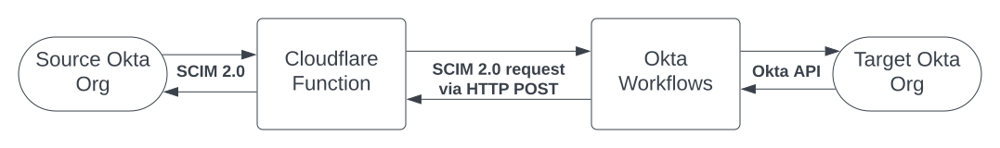

# Workflows SCIM Relay

This is an implementation of a SCIM 2.0 server using the Okta
Workflows product, with help from a Cloudflare Function.

## Overview

The software in this project will enable you to configure a SCIM 2.0
client to any Okta org, allowing you to connect an external user
source to Okta via SCIM 2.0.

That said, please be aware of the following strengths, weaknesses, and
known gaps in this project:

### Strengths

-   Enables you to provision users to an Okta org via SCIM 2.0
-   Doesn't require special programming knowledge to host, run, or modify

### Weaknesses

-   Not tested in production yet
-   Most requests take over 1000 milliseconds to complete

### Known gaps

-   Only tested against Okta's SCIM 2.0 client implementation
-   Does not yet support importing more than 200 groups
-   Only implements header based authentication
-   Only tested to support the `eq` filter on `/Users`

## IMPORTANT

This project is licensed under the terms of the Apache 2.0 license,
which is listed in full in the `LICENSE` file of this repository.

Please note that this means that this software is available **without
support** and **without warranty**:

> Disclaimer of Warranty. Unless required by applicable law or
> agreed to in writing, Licensor provides the Work (and each
> Contributor provides its Contributions) on an "AS IS" BASIS,
> WITHOUT WARRANTIES OR CONDITIONS OF ANY KIND, either express or
> implied, including, without limitation, any warranties or conditions
> of TITLE, NON-INFRINGEMENT, MERCHANTABILITY, or FITNESS FOR A
> PARTICULAR PURPOSE. You are solely responsible for determining the
> appropriateness of using or redistributing the Work and assume any
> risks associated with Your exercise of permissions under this License.

You are solely reponsible for how you use this software. It is not
supported by either Okta or Cloudflare.

# Quickstart

If you are already familiar with Cloudflare Functions and Okta
Workflows, here is a high level overview of what you'll need to do
to get this project set up.

*(in-depth setup instructions are in the works, open an issue the GitHub repository for this project with any questions)*

## Prerequisites

You will need the following:

-   Two Okta orgs:
    1.  A "source" Okta Org, this is what will be sending SCIM 2.0 messages
    2.  A "target" Okta Org, this is what will be receiving SCIM 2.0
        messages
-   An account with Cloudflare
-   This git repository

## Quickstart steps

1.  Clone this repository to your local system
2.  On your "target" Okta Org:
    -   Add a custom profile attribute named `externalId` to the default
        Okta user profile.
        
        You can do this from the Okta Admin UI using: Directory > Profile
        Editor, the selecting the "User (default)" profile, then clicking
        the "Add Attribute" button, then naming the variable `externalId`.
    -   Import the `Workflows_SCIM_Relay.folder` file into Okta
        Workflows. This will create a folder named "SCIM".
    -   Turn on all of the flows in the "SCIM" folder as well as the
        "HTTP Methods" and "Utilities" sub-folders.
    -   Configure the Okta connection to the "target" Okta Org in
        Workflows, so that the SCIM Server is able to access your target
        Okta org.
    -   Open the "Periodically Update Resource Counts In the Metadata
        Table" Scheduled Flow and run it using the "Test" button. This
        will populate the counts of all users and groups, which is a key
        part of what makes the SCIM server work.
    -   Open the "SCIM Server" API Workflow (in the SCIM) folder, and
        copy the "Invoke URL" from the "API Endpoint Settings" of the
        "API Endpoint" card.
3.  Deploy the Cloudflare Functions code in this project to
    Cloudflare. This is a thin HTTP proxy that turns all HTTP requests
    into HTTP POST reqeusts.
    -   Edit the `wrangler.toml` file in this repository. Set the value
        of the `WORKFLOW_URL` variable to the "Invoke URL" as per above.
    -   Install the `wrangler` command.
    -   Run `wrangler publish` to deploy the the Cloudflare Function.
    -   Wrangler should give you a URL where the thin HTTP proxy has been
        deployed. Copy this URL, it should look like this:
        `https://workflows-scim-relay.example.workers.dev`
4.  On your "source" Okta Org:
    -   Use the URL for the thin HTTP proxy to configure your SCIM 2.0
        client in your "source" Okta Org. Don't forget to append
        `/scim/v2/` to the URL.

# How it works

The Workflows SCIM Relay uses Cloudflare to proxy all HTTP requests
made to it into Okta Workflow, which then converts those HTTP requests
into Okta API requests.

What follows is an example of what would happen if the "source" Okta Org were
to make a request for the first user in the "target" Okta Org via SCIM.

The following domains are used in this example:

-   `source.oktapreview.example` - the "source" Okta Org
-   `workflows-scim-relay.example.workers.dev` - the Couldflare Worker
    HTTP proxy
-   `target.workflows.oktapreview.example` - the domain used for Okta
    Workflows in the "target" Okta Org
-   `target.oktapreview.example` - the "target" Okta Org

Using the domains above, here is what would happen if the "source"
Okta Org were to make a request for the first user in the "target"
Okta Org via SCIM:

1.  An HTTP request from `source.oktapreview.example` would be made to
    `workflows-scim-relay.example.workers.dev`. If the `curl` command
    were to make this request, it would look like this:
    
        curl -H $AUTH "https://workflows-scim-relay.jpf.workers.dev/scim/v2/Users?startIndex=1&count=1"
2.  The Cloudflare Worker running at
    `workflows-scim-relay.jpf.workers.dev` would convert this HTTP GET
    request into a single HTTP POST containing JSON that represets the
    GET request as a JSON payload that conforms to the [Request](https://developer.mozilla.org/en-US/docs/Web/API/Request) and [URL](https://developer.mozilla.org/en-US/docs/Web/API/URL)
    objects of the "Fetch" Web API. Here is simplified version of what
    the HTTP GET request above looks like when it's serialised into JSON
    by the Cloudflare proxy:
    
        {
            "redirect": "manual",
            "url": "https://workflows-scim-relay.example.workers.dev/scim/v2/Users?startIndex=1&count=1",
            "method": "GET",
            "body": "",
            "headers": {
                "accept": "*/*",
                "accept-encoding": "gzip",
                "authorization": "Bearer abcd1234efgh",
                "connection": "Keep-Alive",
                "host": "workflows-scim-relay.example.workers.dev",
                "user-agent": "curl/7.88.1",
                "x-forwarded-proto": "https",
                "x-real-ip": "10.115.114.99"
            },
            "whatwgURL": {
                "search": "?startIndex=1&count=1",
                "pathname": "/scim/v2/Users",
                "hostname": "workflows-scim-relay.example.workers.dev",
                "host": "workflows-scim-relay.example.workers.dev",
                "protocol": "https:",
                "href": "https://workflows-scim-relay.example.workers.dev/scim/v2/Users?startIndex=1&count=1",
                "origin": "https://workflows-scim-relay.example.workers.dev",
                "searchParams": {
                    "startIndex": "1",
                    "count": "1"
                }
            }
        }
    
    If the `curl` command were to make
    this request, it would look like this:
    
        curl -X POST -H "Content-Type: application/json" \
             -d '{"redirect":"manual","url":"https://workflows-scim-relay.example.workers.dev/scim/v2/Users?startIndex=1&count=1","method":"GET","body":"","headers":{"accept":"*/*","accept-encoding":"gzip","authorization":"Bearer abcd1234efgh","connection":"Keep-Alive","host":"workflows-scim-relay.example.workers.dev","user-agent":"curl/7.88.1","x-forwarded-proto":"https","x-real-ip":"10.115.114.99"},"whatwgURL":{"search":"?startIndex=1&count=1","pathname":"/scim/v2/Users","hostname":"workflows-scim-relay.example.workers.dev","host":"workflows-scim-relay.example.workers.dev","protocol":"https:","href":"https://workflows-scim-relay.example.workers.dev/scim/v2/Users?startIndex=1&count=1","origin":"https://workflows-scim-relay.example.workers.dev","searchParams":{"startIndex":"1","count":"1"}}}' \
             https://target.workflows.oktapreview.example/api/flo/ab1c23de4fg567h8i9/invoke
3.  The Okta Workflow listening to the API Endpoint at
    `https://target.workflows.oktapreview.example/api/flo/ab1c23de4fg567h8i9/invoke`
    would process the request, and return an appropriate response using HTTP.
4.  The Cloudflare proxy would take the response from the Okta Workflow
    and send it to `source.oktapreview.example`.

# Thanks

Thanks to the following people for their explicit and implict help in
making this project a reality:

-   Aaron Berman for proposing the idea initally
-   Melisa Chaidez for early feedback and suggestions
-   BZ for early feedback
-   Brent Garlow for ongoing encouragement and assistance
-   Max Katz for early gut checks
-   RN for writing up the the results of a similar project, which
    validated my approach
-   Nate Callaghan for an early review and feedback

